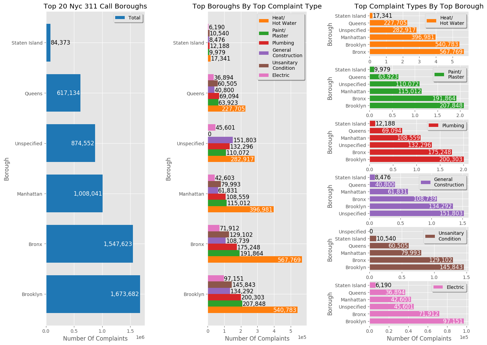

# Plotting NYC 311 Data	
A set of functions allowing for the plotting and grouping of NYC 311 data
wich was downloaded from an opensource database

# Instructions
Run python main function, using functions stored in plotFuns file a plot will
be created showing the 311 data sorted by complaint type and by borough.

